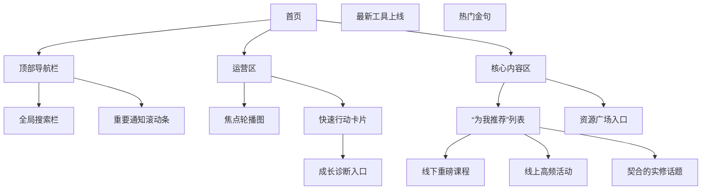
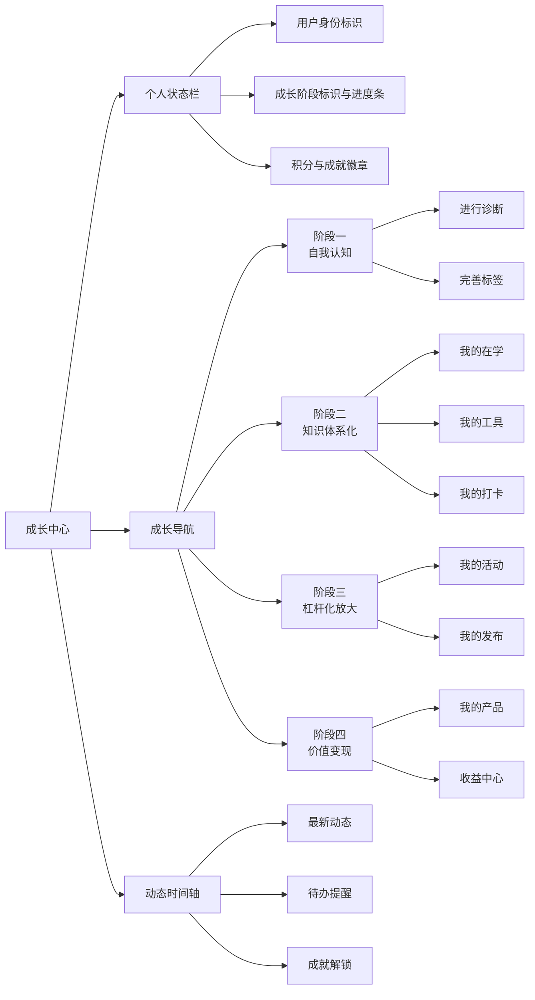
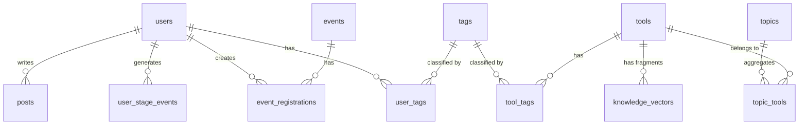

https://yuanbao.tencent.com/chat/naQivTmsDa/4ecba901-20c3-49f5-99ca-87592569d820?projectId=5e1bf96432e84fb384ecc7b345eb2819

# **“十倍好”平台前端需求清单**

#### 一、首页（Home）- 智能发现与引导中心

**设计理念**：不再是简单的信息流，而是基于用户“阶段”与“标签”的**个性化成长导航台**。

| 模块 | 功能点 | 详细说明与交互设计 | 核心价值与业务逻辑 |
| :--- | :--- | :--- | :--- |
| **个性化推送区** | 阶段指引卡片 | 根据用户当前所属的“个人产品化阶段”（如“阶段一：自我认知”），动态显示**最迫切的行动建议**卡片。例如：“恭喜你已完成诊断，下一步是完善你的能力标签”。 | **价值**：实现“千人千面”的引导，极大降低新用户迷茫感，提升留存与推进效率。**业务逻辑**：与后台“用户成长阶段”模型强绑定。 |
| | 推荐活动/内容 | 算法推荐。优先展示与用户“能力标签”匹配度高的线下课程、线上会议、共修话题。 | **价值**：提升活动报名与内容点击率，让用户感觉系统“懂我”。**业务逻辑**：基于标签系统和用户行为数据（浏览、报名、完成）。 |
| **全局导航** | 智能搜索栏 | 支持搜索活动、工具、人、金句。提供搜索建议，结果页支持按类型、标签筛选。 | **价值**：核心信息检索枢纽，提升效率。 |
| | 资源广场快捷入口 | 图标入口，命名为“发现伙伴”或“资源广场”。 | **价值**：显性化“人”的连接价值，促进网络效应。 |

#### 二、成长（Growth）- 个人产品化旅程的核心载体

**设计理念**：用户的**个人商业操作系统（PBOS）仪表盘**，全面可视化其“产品化”进度。

| 模块 | 功能点 | 详细说明与交互设计 | 核心价值与业务逻辑 |
| :--- | :--- | :--- | :--- |
| **成长护照** | 阶段标识与进度 | 顶部醒目位置展示当前阶段（如“阶段二：知识体系化”），并以进度条形式显示进阶进度。点击可查看**阶段详解和进阶任务**。 | **价值**：提供清晰的目标感和成就感。**业务逻辑**：进度由系统根据任务完成度自动计算或由教练手动调整。 |
| | 成长时间轴 | 以时间流形式展示关键里程碑：如“完成自我认知诊断”、“发布第一个工具模板”、“成功主持一次活动”。**支持查看每个里程碑的详细记录和操作人**。 | **价值**：提供完整的成长叙事，增强归属感；**操作溯源**满足审计和回顾需求。 |
| **我的在修** | 当前任务看板 | 聚合展示用户当前需要关注的所有任务：待参加的活动、进行中的打卡、需要回复的提问。 | **价值**：聚焦当下，减少寻找成本，提升任务完成率。 |
| **我的资产** | 我的工具库 | 展示用户创建或收藏的工具、方法论模板。每个工具可显示“使用次数”、“被收藏数”等影响力指标。 | **价值**：激励用户沉淀和分享知识，形成个人品牌资产。 |
| | 我的内容 | 用户发布的所有文章、心得、金句的聚合页。 | **价值**：个人影响力的集中体现。 |
| **能力画像** | 能力星空图 | 用雷达图可视化展示用户在沟通、领导、专业等维度的能力评估。数据来源于标签、他人评价、系统认证。 | **价值**：直观呈现优势与短板，指导后续学习方向。 |

#### 三、知识库（Knowledge）- 智慧沉淀与关联网络

**设计理念**：活的知识图谱，而非静态文档库。

| 模块 | 功能点 | 详细说明与交互设计 | 核心价值与业务逻辑 |
| :--- | :--- | :--- | :--- |
| **话题Wiki页** | 话题聚合页 | 每个核心话题（如“蛋壳理论”）都是结构化聚合页：官方解读、相关工具、用户心得、相关活动、Q&A。**所有元素都通过标签紧密关联**。 | **价值**：根治知识碎片化，提供沉浸式、深度学习体验。**业务逻辑**：基于统一的标签系统和关联关系数据模型。 |
| **互动功能** | 评论与提问 | 支持对工具、金句等进行评论和提问。优质UGC可被运营“精选”并关联至话题页。 | **价值**：促进共创，沉淀社区智慧。 |

#### 四、资源广场（Plaza）- 人的连接器与价值交换市场

**设计理念**：促进“利他”和“连接”的赋能平台。

| 模块 | 功能点 | 详细说明与交互设计 | 核心价值与业务逻辑 |
| :--- | :--- | :--- | :--- |
| **发现伙伴** | 高级筛选与搜索 | 可按“能力标签”、“需要资源”、“所在城市”、“当前阶段”等多维度筛选用户。 | **价值**：实现精准的、高价值的资源对接。 |
| **产品货架** | 个人服务展示 | 用户可将其知识产品（如“1v1咨询”、“代码评审服务”）上架，设置价格、介绍、可预约时间。 | **价值**：为“阶段四：价值变现”提供基础设施，赋能用户将影响力转化为商业价值。 |
| **求助大厅** | 发布与应答 | 用户可发布求助信息（需写清需求、回报），系统可将其智能推荐给可能提供帮助的人。 | **价值**：激活社区互助，是轻量级的价值交换试验场。 |

#### 五、我的（Profile）- 身份管理与系统设置

| 模块 | 功能点 | 详细说明与交互设计 | 核心价值与业务逻辑 |
| :--- | :--- | :--- | :--- |
| **我的标签** | 标签管理 | 用户可编辑“我能提供”（能力、资源）和“我需要”的标签。**界面需清晰展示每个标签的“来源”（自评/系统推荐/官方认证）和“授予时间/操作人”**。 | **价值**：构建精准的“人的模型”，是所有匹配和推荐的基础；**操作溯源**确保标签的公正与权威性。 |
| **设置与反馈** | 意见反馈 | 带截图功能的反馈入口。 | **价值**：核心的产品优化渠道。 |

---

### **核心价值闭环总结**

此方案确保了战略蓝图的不偏离：

1.  **支撑四阶段旅程**：前端通过“成长”页的**阶段标识、进度条、时间轴**，将抽象的模型转化为可视、可感、可执行的用户路径。
2.  **强化赋能网络**：“资源广场”和“知识库”的深度互动设计，将系统中“人”和“知识”的网络效应激活，是“杠杆化”的关键。
3.  **实现价值闭环**：“产品货架”和“求助大厅”等功能，为用户提供了从积累影响力到实现价值变现的完整闭环，真正实现“个人产品化”。
4.  **确保可信与溯源**：遍布系统的**操作历史记录**（标签授予、阶段调整），增强了系统的严肃性和可信度，为运营管理提供依据。

此需求清单为后续的UI/UX设计和高保真原型制作提供了清晰的蓝图和决策依据。

好的，基于这两次深度讨论的共识与战略目标，我将为您呈现一份升华后的、详尽的前端UI设计方案。此方案旨在将“个人产品化四阶段”的顶层战略，转化为直观、可操作的用户界面，确保每一个像素都承载业务价值。

# 设计理念升华：从“功能聚合”到“成长引导”

核心设计原则是：**界面即引导，交互即成长**。UI不仅是功能的容器，更是用户成长的导航仪和成就的展示窗。

---

### 二、全局设计语言与导航

1.  **色彩体系**
    - **主色**：科技蓝（#1677FF），象征理性、成长与数字化。
    - **辅助色**：活力橙（#FF6A00），用于关键行动按钮、成就标识，激发行动欲。
    - **中性色**：多级灰度，确保信息层次清晰。
    - **价值体现**：通过色彩心理学，潜移默化地传递“理性成长”与“积极行动”的品牌调性。

2.  **底部导航栏（5个核心入口）**
    - **首页** - 探索与发现
    - **成长** - 我的中心与旅程
    - **知识库** - 资产沉淀与网络
    - **资源广场** - 人的连接
    - **我的** - 身份与管理

---

### 三、核心页面详细设计

#### 页面一：首页 - 智能化的探索引擎

此页面是用户主动探索的起点，承担着核心的引流和推荐职能。

**功能价值**：
- **个性化推荐**：基于用户身份、阶段及行为数据，实现“千人多面”，提升内容分发效率和用户粘性。
- **敏捷运营**：为运营团队提供强大的曝光位配置能力，支撑线下课程招募、线上活动预热等核心业务场景。
- **成长引导**：将“成长诊断”置于快速入口，主动引导用户开启自我认知之旅。

#### 页面二：成长中心 - 个人成长的指挥舱

这是整个系统的核心，是“个人产品化”旅程的**可视化仪表盘**。

**页面布局与交互逻辑**：

**功能价值**：
- **旅程可视化**：将抽象的四阶段模型转化为具体的、可执行的步骤，极大降低用户的迷茫感。
- **目标驱动**：清晰的进度条和阶段标识，让成长有迹可循，提供持续的动力。
- **一站式管理**：聚合了用户在平台的所有核心资产和行为，是用户的个人管理中心。

#### 页面三：知识库 - 智慧沉淀的网络

**设计细节**：
- **顶部**：全局搜索栏（支持关键词、标签搜索）。
- **主体**：采用**“话题Wiki”页**为基本单位。每个话题页（如“蛋壳理论”）包含：
    1.  **核心释义**：官方权威解读。
    2.  **关联工具**：直接可用的模板、清单。
    3.  **相关金句**：精炼的观点。
    4.  **实践案例**：来自其他用户的打卡、心得UGC。
    5.  **深度讨论**：相关的会议记录、文章。
- **交互**：用户可“关注”话题，在“消息”中心接收更新；可“收藏”具体内容，纳入个人知识体系。

**功能价值**：
- **根治信息碎片化**：通过“话题”聚合所有相关资源，形成知识网络，而非信息孤岛。
- **促进知识复用**：结构化的呈现方式，极大提升了知识的查找效率和复用价值。
- **激发共创**：UGC内容的展示，激励用户贡献自己的实践智慧，形成社区智慧沉淀的飞轮。

#### 页面四：资源广场 - 人的连接器

**设计细节**：
- **顶部**：搜索栏（可按姓名、标签、公司搜索）、筛选器（按身份、城市、能力标签等）。
- **主体**：**用户卡片流**。每个卡片展示：头像、姓名、身份、核心能力标签（最多3个）、最近活跃时间。
- **“求助”功能**：浮动按钮，点击后可发布求助信息（需要什么帮助、可提供的回报），系统可将其推荐给匹配的用户。

**功能价值**：
- **激活网络效应**：将系统中“人”的价值显性化，促进基于能力和资源的精准连接。
- **打造内部价值交换市场**：“求助”功能是“轻量级变现”的试验场，为用户从阶段三向阶段四过渡铺垫。

---

### 四、关键交互组件详细说明

1.  **用户标签系统**
    - **呈现**：在用户主页、资源广场卡片、评论區，以小标签形式出现。
    - **交互**：点击标签，可跳转至该标签的聚合页，看到所有相关的人、内容、活动。
    - **价值**：是打通整个系统信息孤岛的“血管”，是实现精准匹配和智能推荐的基础。

2.  **成长时间轴**
    - **呈现**：在“成长”中心以时间流形式展示。
    - **内容**：包括“完成了XX诊断”、“加入了XX活动”、“发布了首个工具模板”、“XX老师为其认证了‘演讲高手’标签”等。
    - **价值**：为用户提供完整的成长叙事，增强归属感与成就感；为运营者提供审视用户旅程的窗口。

3.  **集成式创建按钮**
    - **设计**：页面右下角悬浮的“+”按钮。
    - **交互**：点击后展开选项：**发布心得**、**发起活动**、**求助**、**创建工具模板**。
    - **价值**：降低UGC门槛，鼓励用户贡献，是填充系统内容的关键入口。

### 五、总结：确保价值不偏离

此UI设计详案始终紧扣两次会议的核心精神：

- **为“个人产品化”服务**：每个页面、每个组件都旨在引导、记录和放大用户的成长。
- **为“运营提效”服务**：通过智能推荐、结构化沉淀，将运营团队从重复劳动中解放出来，聚焦于高价值活动。
- **为“系统增值”服务**：所有交互行为都在为系统积累高质量的数据资产（标签、关系、内容），形成越来越高的竞争壁垒。

此方案可作为下一阶段UI原型设计、开发任务拆分的直接依据。如果您对某个特定交互细节有更深入的设想，我们可以继续聚焦讨论。

好的，基于我们之前所有深度的讨论，特别是“个人产品化四阶段模型”这一顶层战略，以及对前端需求的升华修订，我现在为您提供一份**极致详尽、与前端完全匹配、并深度融入业务逻辑的后端需求清单与分析**。

这份清单将不再是简单的功能罗列，而是**一个完整的后端架构蓝图**，重点阐述后端如何通过API、数据模型和业务逻辑，精准支撑前端的每一个交互，并确保系统的核心价值得以实现。

---

# **“十倍好”平台后端架构需求清单**

#### 一、核心设计理念：领域驱动设计（DDD）与事件溯源

为满足“操作全溯源”和“复杂业务状态流转”的需求，后端架构将采用以下核心设计模式：

| 架构概念 | 应用场景 | 实现价值 |
| :--- | :--- | :--- |
| **领域驱动设计（DDD）** | 将系统划分为`用户（User）`、`知识（Knowledge）`、`活动（Event）`、`标签（Tagging）`等核心领域。每个领域有独立的模型、服务（Service）和资源库（Repository）。 | **高内聚低耦合**，使业务逻辑清晰，便于后续微服务拆分。 |
| **事件溯源（Event Sourcing）** | 应用于**用户成长阶段变更**、**标签授予/移除**、**重要状态更新**等关键业务。任何变更不直接覆盖原数据，而是记录为一条不可变的事件。 | **完美实现操作溯源**，可回溯任意时间点的完整状态，并支持生成“成长时间轴”。 |

---

### 二、后端需求清单（按领域划分）

#### 领域一：用户与身份（User Identity Domain）

**核心职责**：管理一切与“人”相关的数据、认证和生命周期。

| 模块 | 接口（API示例） | 核心业务逻辑与数据模型 | 对应前端功能 | 优先级 |
| :--- | :--- | :--- | :--- | :--- |
| **用户认证** | `POST /api/v1/auth/login` | 支持密码、手机号、微信联合登录。成功後返回JWT Token及完整用户信息。 | 全局登录 | P0 |
| **用户核心信息** | `GET/PUT /api/v1/users/me` | **数据模型`users`**：除基础信息外，核心字段：`current_stage`（枚举：SELF_KNOWLEDGE, ...），`stage_progress`（进度百分比）。 | “我的”页面展示与编辑 | P0 |
| **用户标签系统** | `GET /api/v1/users/me/tags`（我的标签） `POST /api/v1/user-tags`（给用户打标签） | **核心逻辑**： 1. **事件记录**：每次标签变动（增、删、认证）都触发`UserTaggedEvent`，记录`tag_id`, `user_id`, `operator_id`（操作人），`operation`（ADD/REMOVE），`source`（SELF/SYSTEM/ADMIN）。 2. **数据模型**：`user_tags`表包含上述事件所有字段，用于当前状态查询；`user_tag_events`表用于全量溯源。 3. **标签模型**：`tags`表支持层级结构（如`能力/编程/Python`）。 | 能力画像、资源广场筛选 | P1 |
| **用户成长时间轴** | `GET /api/v1/users/me/timeline` | **核心逻辑**：聚合查询多种事件流：`UserStageChangedEvent`（阶段变更）、`UserTaggedEvent`（标签变动）、`EventRegistrationCreatedEvent`（报名活动）等，按时间倒序返回。 | “成长”页时间轴 | P1 |

#### 领域二：知识库（Knowledge Domain）

**核心职责**：管理工具、金句、话题及它们之间的关联关系，赋能AI检索。

| 模块 | 接口（API示例） | 核心业务逻辑与数据模型 | 对应前端功能 | 优先级 |
| :--- | :--- | :--- | :--- | :--- |
| **话题聚合页** | `GET /api/v1/topics/{slug}` | **核心逻辑**： 1. 根据话题slug，获取其详情。 2. **关联查询**：一次性返回与该话题关联的所有`工具(Tool)`、`金句(Quote)`、`活动(Event)`、`用户心得(Post)`。 3. **数据模型**：`topics`表，与`tools`，`quotes`等多对多关联。 | 话题Wiki页 | P0 |
| **工具与内容管理** | `GET /api/v1/tools`（列表） `POST /api/v1/tools`（创建） | **数据模型**：`tools`表包含内容、使用指南等。**关键**：与`tags`多对多关联，用于精准筛选。 | 知识库浏览、内容创建 | P0 |
| **向量检索服务** | `POST /api/v1/search/semantic` | **核心逻辑**： 1. 接收用户查询文本。 2. 使用AI模型将其转换为向量。 3. 在`knowledge_vectors`表中执行相似性搜索（使用pgvector）。 4. 返回最相关的知识片段及其源内容（工具、金句等）。 | 智能搜索 | P1 |

#### 领域三：活动与运营（Event & Operation Domain）

**核心职责**：管理活动生命周期、报名、签到及运营工具。

| 模块 | 接口（API示例） | 核心业务逻辑与数据模型 | 对应前端功能 | 优先级 |
| :--- | :--- | :--- | :--- | :--- |
| **活动管理** | `GET /api/v1/events`（列表） `POST /api/v1/events`（创建） | **数据模型**：`events`表包含类型（线上/线下）、状态、时间、报名设置等。**核心逻辑**：状态机管理（草稿->已发布->进行中->已结束）。 | 首页活动流、活动创建 | P0 |
| **活动报名** | `POST /api/v1/events/{id}/registrations` | **核心逻辑**： 1. **校验**：活动状态、报名截止时间、人数限制。 2. **幂等性**：防止重复报名。 3. **事件触发**：报名成功后，触发`EventRegistrationCreatedEvent`，可用于更新活动人数、触发通知。 | 活动详情页报名 | P0 |
| **运营数据看板** | `GET /api/v1/admin/dashboard` | **核心逻辑**：提供聚合数据：DAU/MAU、活动报名趋势、热门标签、用户阶段分布图。**数据模型**：复杂的SQL查询或基于ELT的数仓表。 | 后台数据看板 | P1 |

#### 领域四：系统与集成（System & Integration Domain）

**核心职责**：提供底层支撑，如文件管理、消息推送、AI集成。

| 模块 | 接口（API示例） | 核心业务逻辑与数据模型 | 对应前端功能 | 优先级 |
| :--- | :--- | :--- | :--- | :--- |
| **文件上传** | `POST /api/v1/upload` | **核心逻辑**：生成预签名URL，直传至云存储（如COS/OSS），回调后记录文件元信息到`files`表。 | 头像、附件上传 | P0 |
| **消息中心** | `GET /api/v1/notifications` | **核心逻辑**：存储用户的通知消息。与微信模板消息服务对接，重要消息双端推送。 | 消息页 | P1 |
| **AI任务队列** | `POST /api/v1/ai/tasks`（提交任务） `GET /api/v1/ai/tasks/{id}`（查询结果） | **核心逻辑**： 1. 接收音频文件或文本。 2. 提交至异步任务队列（如Celery）。 3. 调用AI服务（如DeepSeek、OpenAI）进行处理（转写、总结）。 4. 将结果存储并更新任务状态。 | 会议录音转写、内容摘要 | P2 |

---

### 三、核心数据模型关系图（简化版）

### 四、非功能性需求（架构质量）

| 需求 | 标准与实现方式 | 重要性 |
| :--- | :--- | :--- |
| **性能** | 接口平均响应时间 < 200ms。大量使用Redis缓存（用户信息、热门列表），数据库查询优化（索引、分页）。 | 高 |
| **安全性** | 全链路HTTPS，JWT令牌认证，细粒度API权限控制（基于用户角色/阶段），SQL注入防护，敏感信息加密存储。 | 高 |
| **可扩展性** | 清晰的模块边界为未来微服务化打下基础。使用消息队列（如RabbitMQ）解耦耗时任务（AI处理、邮件发送）。 | 中 |
| **可维护性** | 统一的API返回格式、错误码、日志规范。编写详细的API文档（Swagger/OpenAPI）。 | 高 |

### 总结：后端如何支撑核心业务价值

1. **精准支撑四阶段旅程**：通过`users.current_stage`字段和**状态机逻辑**，确保业务规则（如阶段二用户才能发布工具）得到严格执行。
2. **实现全方位溯源**：通过**事件溯源模式**，记录标签、阶段等关键变更，完美满足“操作有记录，变更可追溯”的需求。
3. **赋能智能推荐**：通过**标签系统**和**向量数据库**，为“资源广场”的精准匹配和首页的个性化推荐提供强大的数据查询能力。
4. **保障运营效率**：**异步任务**和**管理看板API**，让运营团队能从繁琐重复的工作中解放出来，聚焦于高价值活动。

此后端架构方案，与升华后的前端需求清单完美契合，构成了一个完整、健壮且面向未来可扩展的“十倍好”数字化平台技术蓝图。

