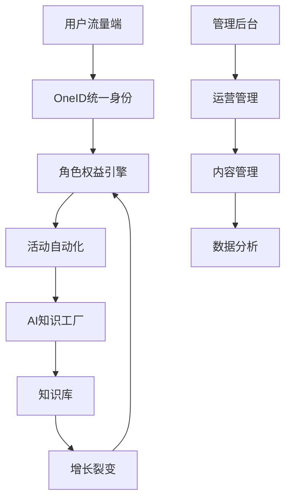

# Better10 数字化平台 - 详细需求设计说明书

**版本**: 1.0  
**状态**: 正式发布  
**日期**: 2026-01-26  
**作者**: AI 架构师  

## 目录

1. [项目概述](#1-项目概述)
2. [业务架构设计](#2-业务架构设计)
3. [数据库设计](#3-数据库设计)
4. [后端API设计](#4-后端api设计)
5. [管理端设计 (front-pc)](#5-管理端设计-front-pc)
6. [小程序端设计 (front-wechat)](#6-小程序端设计-front-wechat)
7. [技术实现方案](#7-技术实现方案)
8. [安全设计](#8-安全设计)
9. [部署运维](#9-部署运维)
10. [实施计划](#10-实施计划)

## 1. 项目概述

### 1.1 项目定位

Better10 是一个基于"宏大单体 (Majestic Monolith)"架构的 AI 原生应用，致力于实现"10倍好"的交付效率与运维体验。平台融合道家智慧，通过**成长导航、知识共生、价值连接**三大核心能力，助力用户生命绽放。

### 1.2 核心业务场景

参考小程序功能规划，平台包含三大核心场景：

1. **新用户溪水入门之旅**：价值触点展示 → 生态位识别 → 首次价值交付
2. **日常成长与贡献循环**：成长地图 → 知识库 → 资源广场 → 积分中心
3. **联创/合伙人生态运营**：管理中心 → 产品货架 → 数据看板

### 1.3 技术架构

- **后端**: Laravel 11 + PostgreSQL 16 (宏大单体架构)
- **管理端**: Filament v3 + TailwindCSS (front-pc)
- **小程序端**: uni-app + Vue 3 + uView Pro (front-wechat)
- **AI能力**: pgvector + LLM集成

## 2. 业务架构设计

### 2.1 核心业务模块



### 2.2 用户角色体系

| 角色 | 权限等级 | 核心功能 | 商业价值 |
|------|----------|----------|----------|
| 粉丝 | 1 | 浏览、学习、参与基础活动 | 流量基础 |
| 高手 | 2 | 提供专业咨询、内容推荐优先 | 专业背书 |
| 合伙人 | 3 | 创建社群、运营产品、分销收益 | 生态运营 |
| 联创 | 4 | 战略参与、资源配置、全局数据 | 战略决策 |
| 平台运营 | 5 | 系统管理、内容审核、数据监控 | 平台保障 |

### 2.3 积分体系设计

#### 2.3.1 积分获取规则

| 行为类型 | 积分值 | 频率限制 | 说明 |
|----------|--------|----------|------|
| 每日签到 | 5-10 | 每日1次 | 基础活跃激励 |
| 发布优质内容 | 20-50 | 不限 | 内容贡献激励 |
| 帮助解决问题 | 10-30 | 每日上限100 | 互助行为激励 |
| 活动参与 | 15-25 | 按活动 | 活动参与激励 |
| 邀请注册 | 50 | 不限 | 增长裂变激励 |

#### 2.3.2 积分消耗规则

| 兑换类型 | 所需积分 | 说明 |
|----------|----------|------|
| 课程优惠券 | 100-500 | 8折优惠券 |
| 专家咨询 | 200-1000 | 30分钟咨询时间 |
| 实体礼品 | 300-2000 | 书籍、文具等 |
| 会员特权 | 500-2000 | 月度/年度会员 |

## 3. 数据库设计

### 3.1 核心数据表结构

#### 3.1.1 用户相关表

```sql
-- 用户主表 (继承universalTable宏)
CREATE TABLE users (
    id UUID PRIMARY KEY DEFAULT gen_random_uuid(),
    name VARCHAR(255) NOT NULL COMMENT '真实姓名',
    mobile VARCHAR(20) UNIQUE NOT NULL COMMENT '手机号',
    password VARCHAR(255) COMMENT '密码哈希',
    email VARCHAR(255) UNIQUE COMMENT '邮箱',
    avatar_url TEXT COMMENT '头像URL',
    status user_status_enum DEFAULT 'PENDING' COMMENT '用户状态',
    role user_role_enum DEFAULT 'MEMBER' COMMENT '用户角色',

    -- 组织架构
    department_id UUID REFERENCES departments(id) ON DELETE SET NULL,

    -- 微信相关
    wechat_unionid VARCHAR(255) UNIQUE COMMENT '微信UnionID',
    wechat_openid VARCHAR(255) UNIQUE COMMENT '微信公众号OpenID',
    miniapp_openid VARCHAR(255) UNIQUE COMMENT '小程序OpenID',

    -- 积分系统
    points INTEGER DEFAULT 0 COMMENT '积分余额',
    total_points INTEGER DEFAULT 0 COMMENT '累计积分',

    -- 成长体系
    growth_stage VARCHAR(50) DEFAULT 'BEGINNER' COMMENT '成长阶段',
    join_date DATE COMMENT '加入日期',

    -- 审计字段 (universalTable宏自动生成)
    created_by UUID REFERENCES users(id),
    updated_by UUID REFERENCES users(id),
    deleted_by UUID,
    created_at TIMESTAMP WITH TIME ZONE DEFAULT NOW(),
    updated_at TIMESTAMP WITH TIME ZONE,
    deleted_at TIMESTAMP WITH TIME ZONE,

    -- 扩展字段
    text1 VARCHAR(255) COMMENT '昵称/显示名',
    text2 VARCHAR(255) COMMENT '个性签名',
    text3 VARCHAR(255) COMMENT '推荐人手机号',
    json_data JSONB COMMENT '扩展数据'
);

-- 用户积分流水表
CREATE TABLE user_point_logs (
    id UUID PRIMARY KEY DEFAULT gen_random_uuid(),
    user_id UUID NOT NULL REFERENCES users(id) ON DELETE CASCADE,
    action_type VARCHAR(50) NOT NULL COMMENT '行为类型',
    points INTEGER NOT NULL COMMENT '积分变动值',
    balance_before INTEGER NOT NULL COMMENT '变动前余额',
    balance_after INTEGER NOT NULL COMMENT '变动后余额',
    description TEXT COMMENT '详细描述',
    related_id UUID COMMENT '关联业务ID',
    created_at TIMESTAMP WITH TIME ZONE DEFAULT NOW()
);
```

#### 3.1.2 内容相关表

```sql
-- 知识内容表
CREATE TABLE knowledge_contents (
    id UUID PRIMARY KEY DEFAULT gen_random_uuid(),
    title VARCHAR(500) NOT NULL COMMENT '标题',
    content TEXT COMMENT '内容',
    content_type VARCHAR(50) DEFAULT 'ARTICLE' COMMENT '内容类型',
    category_id UUID REFERENCES knowledge_categories(id),
    author_id UUID NOT NULL REFERENCES users(id),

    -- 内容状态
    status VARCHAR(20) DEFAULT 'DRAFT' COMMENT '状态',
    publish_at TIMESTAMP WITH TIME ZONE COMMENT '发布时间',

    -- 统计信息
    view_count INTEGER DEFAULT 0 COMMENT '浏览数',
    like_count INTEGER DEFAULT 0 COMMENT '点赞数',
    comment_count INTEGER DEFAULT 0 COMMENT '评论数',
    share_count INTEGER DEFAULT 0 COMMENT '分享数',

    -- SEO优化
    seo_title VARCHAR(255) COMMENT 'SEO标题',
    seo_description TEXT COMMENT 'SEO描述',
    seo_keywords VARCHAR(255) COMMENT 'SEO关键词',

    -- 审计字段
    created_by UUID REFERENCES users(id),
    updated_by UUID REFERENCES users(id),
    deleted_by UUID,
    created_at TIMESTAMP WITH TIME ZONE DEFAULT NOW(),
    updated_at TIMESTAMP WITH TIME ZONE,
    deleted_at TIMESTAMP WITH TIME ZONE,

    -- 扩展字段
    text1 VARCHAR(255) COMMENT '来源',
    text2 VARCHAR(255) COMMENT '标签',
    text3 VARCHAR(255) COMMENT '难度等级',
    json_data JSONB COMMENT '扩展数据'
);

-- 知识分类表
CREATE TABLE knowledge_categories (
    id UUID PRIMARY KEY DEFAULT gen_random_uuid(),
    name VARCHAR(255) NOT NULL COMMENT '分类名称',
    slug VARCHAR(255) UNIQUE NOT NULL COMMENT 'URL标识',
    description TEXT COMMENT '描述',
    parent_id UUID REFERENCES knowledge_categories(id),
    sort_order INTEGER DEFAULT 0 COMMENT '排序',
    is_active BOOLEAN DEFAULT TRUE COMMENT '是否启用',

    created_by UUID REFERENCES users(id),
    updated_by UUID REFERENCES users(id),
    deleted_by UUID,
    created_at TIMESTAMP WITH TIME ZONE DEFAULT NOW(),
    updated_at TIMESTAMP WITH TIME ZONE,
    deleted_at TIMESTAMP WITH TIME ZONE,

    text1 VARCHAR(255) COMMENT '图标',
    text2 VARCHAR(255) COMMENT '颜色',
    text3 VARCHAR(255) COMMENT '权限等级',
    json_data JSONB
);

-- 内容评论表
CREATE TABLE content_comments (
    id UUID PRIMARY KEY DEFAULT gen_random_uuid(),
    content_id UUID NOT NULL REFERENCES knowledge_contents(id) ON DELETE CASCADE,
    user_id UUID NOT NULL REFERENCES users(id) ON DELETE CASCADE,
    parent_id UUID REFERENCES content_comments(id) ON DELETE CASCADE,
    content TEXT NOT NULL COMMENT '评论内容',
    is_approved BOOLEAN DEFAULT TRUE COMMENT '是否审核通过',

    created_by UUID REFERENCES users(id),
    updated_by UUID REFERENCES users(id),
    deleted_by UUID,
    created_at TIMESTAMP WITH TIME ZONE DEFAULT NOW(),
    updated_at TIMESTAMP WITH TIME ZONE,
    deleted_at TIMESTAMP WITH TIME ZONE,

    text1 VARCHAR(255) COMMENT 'IP地址',
    text2 VARCHAR(255) COMMENT '设备信息',
    text3 VARCHAR(255) COMMENT '审核人',
    json_data JSONB
);
```

#### 3.1.3 活动相关表

```sql
-- 活动表
CREATE TABLE events (
    id UUID PRIMARY KEY DEFAULT gen_random_uuid(),
    title VARCHAR(500) NOT NULL COMMENT '活动标题',
    description TEXT COMMENT '活动描述',
    event_type VARCHAR(50) DEFAULT 'ONLINE' COMMENT '活动类型',
    category VARCHAR(50) COMMENT '活动分类',

    -- 时间信息
    start_time TIMESTAMP WITH TIME ZONE NOT NULL,
    end_time TIMESTAMP WITH TIME ZONE NOT NULL,
    registration_deadline TIMESTAMP WITH TIME ZONE,

    -- 容量控制
    max_participants INTEGER COMMENT '最大参与人数',
    registered_count INTEGER DEFAULT 0 COMMENT '已报名人数',
    version INTEGER DEFAULT 1 COMMENT '乐观锁版本号',

    -- 活动详情
    location TEXT COMMENT '活动地点',
    meeting_url TEXT COMMENT '会议链接',
    cover_image_url TEXT COMMENT '封面图片',

    -- 状态管理
    status event_status_enum DEFAULT 'DRAFT' COMMENT '活动状态',
    is_public BOOLEAN DEFAULT TRUE COMMENT '是否公开',

    -- 积分设置
    points_reward INTEGER DEFAULT 0 COMMENT '参与积分奖励',

    created_by UUID REFERENCES users(id),
    updated_by UUID REFERENCES users(id),
    deleted_by UUID,
    created_at TIMESTAMP WITH TIME ZONE DEFAULT NOW(),
    updated_at TIMESTAMP WITH TIME ZONE,
    deleted_at TIMESTAMP WITH TIME ZONE,

    text1 VARCHAR(255) COMMENT '活动标签',
    text2 VARCHAR(255) COMMENT '主办方',
    text3 VARCHAR(255) COMMENT '联系方式',
    json_data JSONB COMMENT '扩展配置'
);

-- 活动报名表
CREATE TABLE event_registrations (
    id UUID PRIMARY KEY DEFAULT gen_random_uuid(),
    event_id UUID NOT NULL REFERENCES events(id) ON DELETE CASCADE,
    user_id UUID NOT NULL REFERENCES users(id) ON DELETE CASCADE,
    registration_time TIMESTAMP WITH TIME ZONE DEFAULT NOW(),
    status VARCHAR(20) DEFAULT 'REGISTERED' COMMENT '报名状态',
    check_in_time TIMESTAMP WITH TIME ZONE COMMENT '签到时间',
    notes TEXT COMMENT '备注',

    created_by UUID REFERENCES users(id),
    updated_by UUID REFERENCES users(id),
    deleted_by UUID,
    created_at TIMESTAMP WITH TIME ZONE DEFAULT NOW(),
    updated_at TIMESTAMP WITH TIME ZONE,
    deleted_at TIMESTAMP WITH TIME ZONE,

    UNIQUE(event_id, user_id)
);
```

#### 3.1.4 AI相关表

```sql
-- AI任务表
CREATE TABLE ai_tasks (
    id UUID PRIMARY KEY DEFAULT gen_random_uuid(),
    task_type VARCHAR(50) NOT NULL COMMENT '任务类型',
    status ai_task_status_enum DEFAULT 'PENDING' COMMENT '任务状态',
    priority INTEGER DEFAULT 1 COMMENT '优先级',

    -- 关联对象
    related_type VARCHAR(50) COMMENT '关联类型',
    related_id UUID COMMENT '关联ID',

    -- 任务配置
    config JSONB COMMENT '任务配置参数',
    result JSONB COMMENT '任务结果',

    -- 进度跟踪
    progress_percentage INTEGER DEFAULT 0 COMMENT '进度百分比',
    error_message TEXT COMMENT '错误信息',

    -- 时间戳
    started_at TIMESTAMP WITH TIME ZONE,
    completed_at TIMESTAMP WITH TIME ZONE,

    created_by UUID REFERENCES users(id),
    updated_by UUID REFERENCES users(id),
    deleted_by UUID,
    created_at TIMESTAMP WITH TIME ZONE DEFAULT NOW(),
    updated_at TIMESTAMP WITH TIME ZONE,
    deleted_at TIMESTAMP WITH TIME ZONE
);

-- AI向量知识库
CREATE TABLE ai_vectors (
    id BIGSERIAL PRIMARY KEY,
    content_chunk TEXT NOT NULL COMMENT '文本切片内容',
    embedding VECTOR(1536) COMMENT '向量数据',
    metadata JSONB COMMENT '元数据',

    -- 关联信息
    source_type VARCHAR(50) COMMENT '来源类型',
    source_id UUID COMMENT '来源ID',

    created_at TIMESTAMP WITH TIME ZONE DEFAULT NOW()
);

-- 创建向量索引
CREATE INDEX ON ai_vectors USING hnsw (embedding vector_cosine_ops);
```

### 3.2 数据库优化策略

#### 3.2.1 索引设计

```sql
-- 用户表索引
CREATE INDEX idx_users_mobile ON users(mobile);
CREATE INDEX idx_users_wechat_unionid ON users(wechat_unionid);
CREATE INDEX idx_users_status ON users(status);
CREATE INDEX idx_users_role ON users(role);
CREATE INDEX idx_users_department ON users(department_id);
CREATE INDEX idx_users_points ON users(points);

-- 内容表索引
CREATE INDEX idx_knowledge_contents_status ON knowledge_contents(status);
CREATE INDEX idx_knowledge_contents_publish_at ON knowledge_contents(publish_at);
CREATE INDEX idx_knowledge_contents_category ON knowledge_contents(category_id);
CREATE INDEX idx_knowledge_contents_author ON knowledge_contents(author_id);
CREATE INDEX idx_knowledge_search_vector ON knowledge_contents USING GIN(search_vector);

-- 活动表索引
CREATE INDEX idx_events_status ON events(status);
CREATE INDEX idx_events_start_time ON events(start_time);
CREATE INDEX idx_events_type ON events(event_type);
```

#### 3.2.2 分区策略

```sql
-- 按月分区用户积分流水表
CREATE TABLE user_point_logs_y2026m01 PARTITION OF user_point_logs
    FOR VALUES FROM ('2026-01-01') TO ('2026-02-01');

-- 按类型分区AI任务表
CREATE TABLE ai_tasks_asr PARTITION OF ai_tasks
    FOR VALUES IN ('ASR_TRANSCRIPTION');
CREATE TABLE ai_tasks_vector PARTITION OF ai_tasks
    FOR VALUES IN ('VECTOR_EMBEDDING');
```

## 4. 后端API设计

### 4.1 API架构设计

#### 4.1.1 RESTful API规范

```
GET    /api/v1/users              # 获取用户列表
POST   /api/v1/users              # 创建用户
GET    /api/v1/users/{id}         # 获取用户详情
PUT    /api/v1/users/{id}         # 更新用户
DELETE /api/v1/users/{id}         # 删除用户

GET    /api/v1/knowledge          # 获取知识列表
POST   /api/v1/knowledge          # 创建知识内容
GET    /api/v1/knowledge/{id}     # 获取知识详情
PUT    /api/v1/knowledge/{id}     # 更新知识内容
DELETE /api/v1/knowledge/{id}     # 删除知识内容
```

#### 4.1.2 响应格式规范

```json
{
  "success": true,
  "data": {
    "id": "uuid",
    "name": "用户名",
    "created_at": "2026-01-26T10:00:00Z"
  },
  "meta": {
    "pagination": {
      "total": 100,
      "per_page": 20,
      "current_page": 1,
      "last_page": 5
    }
  },
  "message": "操作成功"
}
```

### 4.2 核心API接口

#### 4.2.1 用户管理API

```php
// OneID统一身份认证
Route::prefix('auth')->group(function () {
    Route::post('login', [AuthController::class, 'login']);
    Route::post('register', [AuthController::class, 'register']);
    Route::post('wechat/login', [AuthController::class, 'wechatLogin']);
    Route::post('logout', [AuthController::class, 'logout']);
    Route::post('refresh', [AuthController::class, 'refresh']);
});

// 用户管理
Route::apiResource('users', UserController::class);
Route::get('users/{user}/profile', [UserController::class, 'profile']);
Route::put('users/{user}/profile', [UserController::class, 'updateProfile']);
Route::post('users/{user}/avatar', [UserController::class, 'uploadAvatar']);
```

#### 4.2.2 知识库API

```php
Route::apiResource('knowledge', KnowledgeController::class);
Route::get('knowledge/categories', [KnowledgeController::class, 'categories']);
Route::get('knowledge/search', [KnowledgeController::class, 'search']);
Route::post('knowledge/{knowledge}/like', [KnowledgeController::class, 'like']);
Route::post('knowledge/{knowledge}/share', [KnowledgeController::class, 'share']);
Route::get('knowledge/{knowledge}/comments', [KnowledgeController::class, 'comments']);
Route::post('knowledge/{knowledge}/comments', [KnowledgeController::class, 'addComment']);
```

#### 4.2.3 活动管理API

```php
Route::apiResource('events', EventController::class);
Route::post('events/{event}/register', [EventController::class, 'register']);
Route::post('events/{event}/check-in', [EventController::class, 'checkIn']);
Route::get('events/{event}/participants', [EventController::class, 'participants']);
Route::post('events/{event}/cancel', [EventController::class, 'cancelRegistration']);
```

#### 4.2.4 积分系统API

```php
Route::get('points/balance', [PointController::class, 'balance']);
Route::get('points/history', [PointController::class, 'history']);
Route::post('points/earn', [PointController::class, 'earn']);
Route::post('points/spend', [PointController::class, 'spend']);
Route::get('points/rewards', [PointController::class, 'rewards']);
Route::post('points/redeem/{reward}', [PointController::class, 'redeem']);
```

### 4.3 Action层设计

#### 4.3.1 Service Action模式

```php
<?php

namespace App\Actions\User;

use App\Models\User;
use App\Data\User\CreateUserDto;
use App\Enums\UserStatus;

class CreateUserAction
{
    public function handle(CreateUserDto $dto): User
    {
        $user = User::create([
            'name' => $dto->name,
            'mobile' => $dto->mobile,
            'password' => Hash::make($dto->password),
            'status' => UserStatus::PENDING,
            'department_id' => $dto->department_id,
        ]);

        // 触发领域事件
        UserRegistered::dispatch($user);

        return $user;
    }
}
```

#### 4.3.2 DTO数据契约

```php
<?php

namespace App\Data\User;

use Spatie\LaravelData\Data;
use Spatie\LaravelData\Attributes\Validation\Required;
use Spatie\LaravelData\Attributes\Validation\Unique;

class CreateUserDto extends Data
{
    public function __construct(
        #[Required]
        public string $name,

        #[Required]
        #[Unique('users', 'mobile')]
        public string $mobile,

        #[Required]
        public string $password,

        public ?string $department_id = null,
        public ?string $inviter_mobile = null,
    ) {}
}
```

## 5. 管理端设计 (front-pc)

### 5.1 技术栈选择

参考 catch-admin 项目，采用：
- **框架**: Filament v3 + Laravel 11
- **UI组件**: TailwindCSS + Alpine.js
- **图表**: Chart.js 或 ApexCharts
- **表格**: Filament Tables
- **表单**: Filament Forms

### 5.2 页面结构设计

#### 5.2.1 主布局

```php
// App\Filament\Resources\UserResource.php
class UserResource extends Resource
{
    protected static ?string $model = User::class;
    protected static ?string $navigationIcon = 'heroicon-o-users';
    protected static ?string $navigationGroup = '用户管理';
    protected static ?int $navigationSort = 1;

    public static function form(Form $form): Form
    {
        return $form->schema([
            Section::make('基本信息')
                ->schema([
                    TextInput::make('name')->required()->label('姓名'),
                    TextInput::make('mobile')->required()->unique()->label('手机号'),
                    Select::make('department_id')
                        ->relationship('department', 'name')
                        ->required()
                        ->label('部门'),
                    Select::make('role')
                        ->options(UserRole::class)
                        ->required()
                        ->label('角色'),
                ]),
        ]);
    }

    public static function table(Table $table): Table
    {
        return $table->columns([
            TextColumn::make('name')->sortable()->searchable()->label('姓名'),
            TextColumn::make('mobile')->sortable()->searchable()->label('手机号'),
            TextColumn::make('department.name')->sortable()->label('部门'),
            BadgeColumn::make('role')
                ->colors(['primary', 'success', 'warning', 'danger'])
                ->icons(['heroicon-o-star', 'heroicon-o-shield-check'])
                ->label('角色'),
            TextColumn::make('points')->sortable()->label('积分'),
            BadgeColumn::make('status')
                ->colors(['secondary', 'success', 'warning', 'danger'])
                ->label('状态'),
            TextColumn::make('created_at')->dateTime()->sortable()->label('注册时间'),
        ]);
    }
}
```

#### 5.2.2 核心管理页面

##### 5.2.2.1 用户管理页面

- **列表视图**: 表格显示用户基本信息、状态、积分等
- **详情视图**: 用户详细信息、操作日志、积分流水
- **编辑表单**: 基本信息修改、角色调整、状态变更
- **批量操作**: 批量导入、批量状态变更、批量积分调整

##### 5.2.2.2 内容管理页面

- **知识库管理**: 内容创建、编辑、审核、发布
- **分类管理**: 分类层级结构维护
- **评论管理**: 评论审核、回复、删除
- **统计分析**: 内容访问量、用户活跃度等数据图表

##### 5.2.2.3 活动管理页面

- **活动列表**: 活动状态监控、报名情况
- **活动创建**: 活动信息录入、时间设置、容量配置
- **报名管理**: 报名审核、签到管理、数据导出
- **活动统计**: 参与率分析、用户反馈收集

##### 5.2.2.4 数据分析页面

- **用户分析**: 用户增长趋势、活跃度分析、地域分布
- **内容分析**: 内容发布统计、访问量分析、用户偏好
- **活动分析**: 活动参与情况、转化率分析
- **积分分析**: 积分消耗情况、激励效果评估

### 5.3 权限控制设计

```php
// 基于角色的权限控制
class UserPolicy
{
    public function viewAny(User $user): bool
    {
        return $user->hasRole(['admin', 'manager']);
    }

    public function create(User $user): bool
    {
        return $user->hasRole('admin');
    }

    public function update(User $user, User $model): bool
    {
        return $user->hasRole('admin') ||
               ($user->hasRole('manager') && $user->department_id === $model->department_id);
    }
}
```

## 6. 小程序端设计 (front-wechat)

### 6.1 技术栈完善

当前 front-wechat 使用 uni-app，需要完善：
- **UI框架**: 保持 uView Pro，升级到最新版本
- **状态管理**: 引入 Pinia 进行全局状态管理
- **网络请求**: 统一 API 请求封装
- **路由守卫**: 实现登录状态检查
- **缓存策略**: 本地存储策略优化

### 6.2 页面结构设计

#### 6.2.1 核心页面清单

基于小程序功能规划，实现以下核心页面：

```
pages/
├── index/                    # 首页 - 价值流展示
├── auth/                     # 认证相关
│   ├── login.vue            # 手机号登录
│   ├── register.vue         # 注册
│   └── wechat-auth.vue      # 微信授权
├── growth/                   # 成长体系
│   ├── map.vue              # 成长地图
│   ├── tasks.vue            # 成长任务
│   └── achievements.vue     # 成就展示
├── knowledge/               # 知识库
│   ├── index.vue            # 知识首页
│   ├── detail.vue           # 内容详情
│   ├── categories.vue       # 分类浏览
│   └── search.vue           # 搜索页面
├── community/               # 社区功能
│   ├── square.vue           # 资源广场
│   ├── experts.vue          # 高手列表
│   ├── help.vue             # 求助大厅
│   └── groups.vue           # 社群管理
├── events/                  # 活动相关
│   ├── index.vue            # 活动列表
│   ├── detail.vue           # 活动详情
│   └── my-events.vue        # 我的活动
├── points/                  # 积分中心
│   ├── index.vue            # 积分首页
│   ├── history.vue          # 积分流水
│   ├── rewards.vue          # 兑换中心
│   └── ranking.vue          # 积分排行
├── profile/                 # 个人中心
│   ├── index.vue            # 个人主页
│   ├── info.vue             # 个人信息
│   ├── settings.vue         # 设置页面
│   └── wallet.vue           # 权益钱包
└── partner/                 # 合伙人功能
    ├── dashboard.vue        # 运营看板
    ├── products.vue         # 产品货架
    └── analytics.vue        # 数据分析
```

### 6.3 核心功能实现

#### 6.3.1 首页价值流

```vue
<template>
  <view class="index-page">
    <!-- 价值触点流 -->
    <swiper class="value-stream" autoplay circular>
      <swiper-item v-for="story in valueStories" :key="story.id">
        <view class="story-card" @click="goToStory(story)">
          <image :src="story.cover" mode="aspectFill" />
          <view class="story-content">
            <text class="title">{{ story.title }}</text>
            <text class="desc">{{ story.description }}</text>
          </view>
        </view>
      </swiper-item>
    </swiper>

    <!-- 快速入口 -->
    <view class="quick-actions">
      <view class="action-grid">
        <view class="action-item" @click="goToGrowthMap">
          <view class="icon">🗺️</view>
          <text>成长地图</text>
        </view>
        <view class="action-item" @click="goToKnowledge">
          <view class="icon">📚</view>
          <text>知识库</text>
        </view>
        <view class="action-item" @click="goToCommunity">
          <view class="icon">👥</view>
          <text>社区</text>
        </view>
        <view class="action-item" @click="goToEvents">
          <view class="icon">📅</view>
          <text>活动</text>
        </view>
      </view>
    </view>

    <!-- 新手任务引导 -->
    <view v-if="showNewbieTasks" class="newbie-guide">
      <view class="guide-card">
        <text class="guide-title">欢迎加入10倍好大家庭！</text>
        <view class="task-list">
          <view
            v-for="task in newbieTasks"
            :key="task.id"
            class="task-item"
            :class="{ completed: task.completed }"
            @click="completeTask(task)"
          >
            <view class="task-icon">{{ task.icon }}</view>
            <view class="task-info">
              <text class="task-title">{{ task.title }}</text>
              <text class="task-desc">{{ task.description }}</text>
            </view>
            <view class="task-reward">+{{ task.points }}积分</view>
          </view>
        </view>
      </view>
    </view>
  </view>
</template>
```

#### 6.3.2 成长地图组件

```vue
<template>
  <view class="growth-map">
    <!-- 阶段指示器 -->
    <view class="stage-indicator">
      <view
        v-for="(stage, index) in growthStages"
        :key="stage.id"
        class="stage-item"
        :class="{
          active: currentStage.id === stage.id,
          completed: stage.completed
        }"
      >
        <view class="stage-circle">
          <text class="stage-number">{{ index + 1 }}</text>
        </view>
        <text class="stage-name">{{ stage.name }}</text>
        <view v-if="stage.completed" class="completed-badge">✓</view>
      </view>
    </view>

    <!-- 当前阶段详情 -->
    <view class="current-stage-detail">
      <view class="stage-header">
        <text class="stage-title">{{ currentStage.name }}</text>
        <text class="stage-desc">{{ currentStage.description }}</text>
      </view>

      <!-- 阶段目标 -->
      <view class="stage-goals">
        <view
          v-for="goal in currentStage.goals"
          :key="goal.id"
          class="goal-item"
          :class="{ achieved: goal.achieved }"
        >
          <view class="goal-icon">{{ goal.icon }}</view>
          <view class="goal-content">
            <text class="goal-title">{{ goal.title }}</text>
            <text class="goal-progress">{{ goal.progress }}/{{ goal.target }}</text>
          </view>
          <view v-if="goal.achieved" class="achieved-badge">达成</view>
        </view>
      </view>

      <!-- 推荐任务 -->
      <view class="recommended-tasks">
        <text class="section-title">推荐任务</text>
        <view class="task-list">
          <view
            v-for="task in recommendedTasks"
            :key="task.id"
            class="task-card"
            @click="startTask(task)"
          >
            <view class="task-header">
              <text class="task-title">{{ task.title }}</text>
              <view class="task-reward">
                <text>+{{ task.points }}积分</text>
              </view>
            </view>
            <text class="task-desc">{{ task.description }}</text>
            <view class="task-meta">
              <text class="task-difficulty">{{ task.difficulty }}</text>
              <text class="task-duration">{{ task.duration }}</text>
            </view>
          </view>
        </view>
      </view>
    </view>
  </view>
</template>
```

#### 6.3.3 积分中心

```vue
<template>
  <view class="points-center">
    <!-- 积分余额卡片 -->
    <view class="balance-card">
      <view class="balance-header">
        <text class="balance-label">当前积分</text>
        <text class="balance-amount">{{ userPoints }}</text>
      </view>
      <view class="balance-actions">
        <button class="earn-btn" @click="goToEarn">赚取积分</button>
        <button class="spend-btn" @click="goToRewards">兑换奖励</button>
      </view>
    </view>

    <!-- 积分排行榜 -->
    <view class="ranking-section">
      <view class="section-header">
        <text class="section-title">积分排行榜</text>
        <view class="ranking-tabs">
          <text
            v-for="period in rankingPeriods"
            :key="period.key"
            :class="['tab-item', { active: activePeriod === period.key }]"
            @click="switchPeriod(period.key)"
          >
            {{ period.label }}
          </text>
        </view>
      </view>

      <view class="ranking-list">
        <view
          v-for="(user, index) in rankingList"
          :key="user.id"
          class="ranking-item"
          :class="{ 'is-current-user': user.isCurrentUser }"
        >
          <view class="rank-number">
            <text v-if="index < 3" class="rank-badge">{{ rankBadges[index] }}</text>
            <text v-else>{{ index + 1 }}</text>
          </view>
          <view class="user-avatar">
            <image :src="user.avatar" mode="aspectFill" />
          </view>
          <view class="user-info">
            <text class="user-name">{{ user.name }}</text>
            <text class="user-points">{{ user.points }}积分</text>
          </view>
          <view v-if="user.isCurrentUser" class="current-user-badge">我</view>
        </view>
      </view>
    </view>

    <!-- 积分历史 -->
    <view class="history-section">
      <text class="section-title">积分历史</text>
      <view class="history-list">
        <view
          v-for="record in pointHistory"
          :key="record.id"
          class="history-item"
        >
          <view class="history-icon">
            <text>{{ record.type === 'earn' ? '+' : '-' }}</text>
          </view>
          <view class="history-content">
            <text class="history-desc">{{ record.description }}</text>
            <text class="history-time">{{ record.created_at }}</text>
          </view>
          <view class="history-amount" :class="record.type">
            <text>{{ record.type === 'earn' ? '+' : '-' }}{{ record.points }}</text>
          </view>
        </view>
      </view>
    </view>
  </view>
</template>
```

## 7. 技术实现方案

### 7.1 后端架构完善

参考 catch-admin 和 likeshop 的后端架构，对 end-api 进行以下改进：

#### 7.1.1 模块化架构

```
app/
├── Actions/          # 业务逻辑层 (保持现有)
├── Data/            # DTO层 (保持现有)
├── Models/          # 模型层
├── Services/        # 外部服务集成
├── Http/
│   ├── Controllers/ # API控制器
│   ├── Middleware/  # 中间件
│   └── Requests/    # 请求验证
├── Console/         # 命令行工具
├── Events/          # 事件系统
├── Jobs/            # 队列任务
├── Listeners/       # 事件监听器
├── Policies/        # 权限策略
├── Providers/       # 服务提供者
└── Traits/          # 特性复用
```

#### 7.1.2 核心服务层

```php
// 微信服务集成
class WeChatService
{
    public function getUserInfo(string $code): array
    {
        // 微信授权登录
    }

    public function sendTemplateMessage(string $openid, array $data): bool
    {
        // 发送模板消息
    }
}

// 小鹅通服务集成
class XiaoETongService
{
    public function syncUser(User $user): bool
    {
        // 同步用户到小鹅通
    }

    public function syncOrder(Order $order): bool
    {
        // 同步订单信息
    }
}

// AI服务集成
class AIService
{
    public function transcribeAudio(string $audioUrl): array
    {
        // 音频转写
    }

    public function generateEmbedding(string $text): array
    {
        // 生成向量
    }

    public function searchSimilar(string $query, int $limit = 10): array
    {
        // 向量搜索
    }
}
```

### 7.2 前端技术栈升级

#### 7.2.1 管理端 (front-pc)

新建项目，采用现代化的技术栈：

```json
{
  "name": "better10-admin",
  "private": true,
  "type": "module",
  "scripts": {
    "dev": "vite",
    "build": "vite build",
    "preview": "vite preview"
  },
  "dependencies": {
    "@inertiajs/vue3": "^1.0.0",
    "@vitejs/plugin-vue": "^4.0.0",
    "axios": "^1.4.0",
    "vue": "^3.3.0",
    "pinia": "^2.1.0",
    "vue-router": "^4.2.0",
    "element-plus": "^2.3.0",
    "echarts": "^5.4.0",
    "@element-plus/icons-vue": "^2.1.0"
  },
  "devDependencies": {
    "@types/node": "^20.0.0",
    "typescript": "^5.0.0",
    "vite": "^4.3.0",
    "tailwindcss": "^3.3.0"
  }
}
```

#### 7.2.2 小程序端完善

完善现有 uni-app 项目：

```json
{
  "dependencies": {
    "@dcloudio/uni-app": "^3.0.0",
    "@dcloudio/uni-h5": "^3.0.0",
    "@dcloudio/uni-mp-weixin": "^3.0.0",
    "uview-pro": "^2.0.0",
    "pinia": "^2.1.0",
    "pinia-plugin-persistedstate": "^3.0.0",
    "@uni-helper/uni-network": "^0.10.0",
    "dayjs": "^1.11.0"
  }
}
```

## 8. 安全设计

### 8.1 认证安全

- **JWT Token**: API认证使用JWT，支持多端登录
- **微信授权**: 小程序使用微信授权登录
- **密码安全**: bcrypt哈希，密码复杂度要求
- **Session管理**: Redis存储会话，支持单点登录

### 8.2 数据安全

- **数据加密**: 敏感数据加密存储
- **SQL注入防护**: 使用Eloquent ORM参数绑定
- **XSS防护**: 前端数据转义，后端内容过滤
- **CSRF防护**: Laravel CSRF Token机制

### 8.3 权限控制

- **RBAC模型**: 基于角色的访问控制
- **API权限**: 细粒度的API权限控制
- **数据权限**: 部门隔离、用户数据隔离
- **审计日志**: 所有重要操作记录

## 9. 部署运维

### 9.1 容器化部署

```yaml
# docker-compose.yml
version: '3.8'
services:
  app:
    build:
      context: .
      dockerfile: docker/php/Dockerfile
    volumes:
      - ./src:/var/www/html
    environment:
      - APP_ENV=production
    depends_on:
      - db
      - redis

  db:
    image: postgres:16
    environment:
      - POSTGRES_DB=better10
      - POSTGRES_USER=postgres
      - POSTGRES_PASSWORD=secret
    volumes:
      - db_data:/var/lib/postgresql/data
      - ./docker/postgres/init.sql:/docker-entrypoint-initdb.d/init.sql

  redis:
    image: redis:7-alpine
    volumes:
      - redis_data:/data

  nginx:
    image: nginx:alpine
    ports:
      - "80:80"
      - "443:443"
    volumes:
      - ./docker/nginx/conf.d:/etc/nginx/conf.d
      - ./src/public:/var/www/html/public

volumes:
  db_data:
  redis_data:
```

### 9.2 CI/CD流程

```yaml
# .github/workflows/deploy.yml
name: Deploy to Production
on:
  push:
    branches: [ main ]
jobs:
  test:
    runs-on: ubuntu-latest
    steps:
      - uses: actions/checkout@v3
      - name: Setup PHP
        uses: shivammathur/setup-php@v2
        with:
          php-version: '8.3'
      - name: Install dependencies
        run: composer install
      - name: Run tests
        run: php artisan test

  deploy:
    needs: test
    runs-on: ubuntu-latest
    steps:
      - name: Deploy to server
        run: |
          ssh user@server "cd /var/www/html && git pull && composer install --no-dev && php artisan migrate --force"
```

## 10. 实施计划

### 10.1 第一阶段：基础架构搭建 (2周)

1. **数据库设计完善**
   - 完成所有表结构设计
   - 建立索引和约束
   - 初始化数据迁移

2. **后端API基础**
   - 用户认证API
   - 基础CRUD API
   - 权限控制框架

3. **管理端基础框架**
   - Filament v3安装配置
   - 基础页面布局
   - 用户管理模块

### 10.2 第二阶段：核心功能开发 (4周)

1. **知识库系统**
   - 内容管理API
   - 分类管理
   - 搜索功能

2. **活动管理系统**
   - 活动CRUD
   - 报名系统
   - 签到功能

3. **积分系统**
   - 积分计算逻辑
   - 积分兑换
   - 排行榜功能

### 10.3 第三阶段：小程序开发 (4周)

1. **小程序基础框架**
   - 页面结构搭建
   - 路由配置
   - 状态管理

2. **核心功能实现**
   - 首页价值流
   - 成长地图
   - 知识库浏览

3. **社区功能**
   - 资源广场
   - 求助大厅
   - 积分中心

### 10.4 第四阶段：AI能力集成 (2周)

1. **AI服务集成**
   - 腾讯云ASR集成
   - 向量数据库配置
   - AI搜索功能

2. **智能内容处理**
   - 会议录音转写
   - 内容自动摘要
   - 智能推荐

### 10.5 第五阶段：测试与优化 (2周)

1. **系统测试**
   - 单元测试完善
   - 集成测试
   - 性能测试

2. **用户体验优化**
   - 界面优化
   - 交互改进
   - 性能优化

3. **部署上线**
   - 生产环境部署
   - 监控配置
   - 文档完善

### 10.6 里程碑计划

| 阶段 | 时间 | 交付物 | 验收标准 |
|------|------|--------|----------|
| 架构搭建 | 第1-2周 | 数据库设计、基础API、管理端框架 | 核心表结构完成，基础CRUD可用 |
| 核心功能 | 第3-6周 | 知识库、活动、积分系统 | 主要业务流程跑通 |
| 小程序开发 | 第7-10周 | 完整小程序功能 | 用户可正常使用核心功能 |
| AI集成 | 第11-12周 | AI转写、搜索功能 | 智能功能正常工作 |
| 测试优化 | 第13-14周 | 完整的生产系统 | 系统稳定，性能达标 |

### 10.7 风险控制

1. **技术风险**: 提前调研关键技术，准备备用方案
2. **进度风险**: 设立里程碑检查点，及时调整计划
3. **质量风险**: 实施代码审查，自动化测试覆盖
4. **沟通风险**: 定期会议同步进展，文档及时更新

---

**文档版本**: 1.0  
**最后更新**: 2026-01-26  
**负责人**: AI架构师  
**审核人**: 项目经理